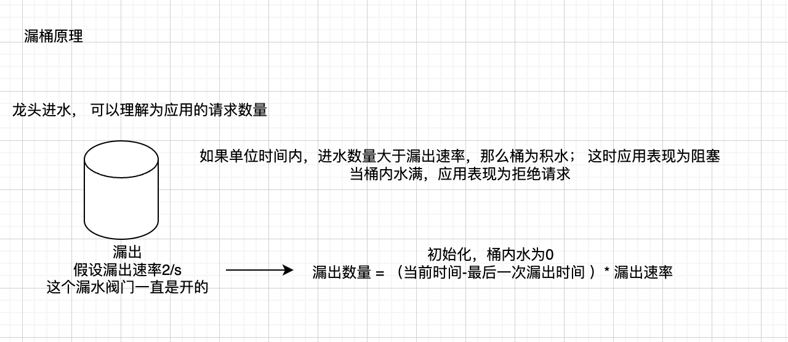
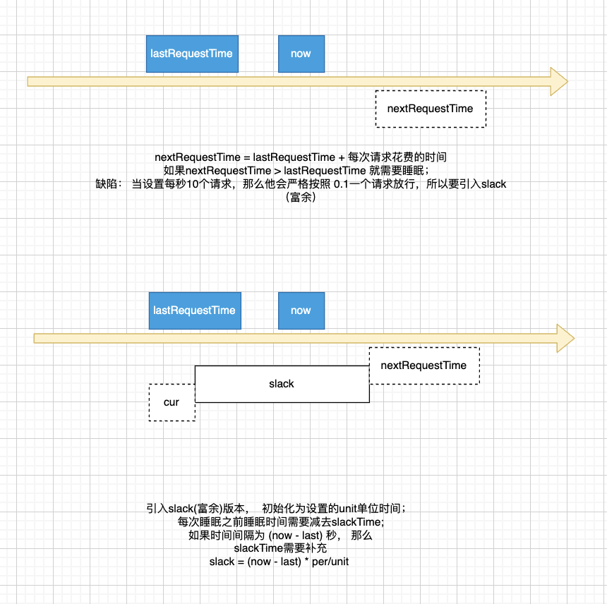

## 工作原理

- 漏桶： 适用场景，限制访问频率；
- 漏桶分布式： 限制分布式访问
- 令牌桶使用场景： 平衡负载；

  - 类型一： 令牌为一次性消耗品,固定桶大小以及令牌生产速度, （开启50个线程消费， 最开始可以借出去50个令牌，后面会变少
  - 类型二： 令牌固定数量，消费完会返回桶内， 可多次消费 (本质上就是线程池模型)

### 漏桶

漏洞原理：



实现：

- 为了使结果更具线性，将可漏出数量转换为时间 （lastReqeustTime,slackTime)
- timeout适用场景为异步并发场景；
- 
- 

  Examples

```golang


rl := ratelimit.NewLeakyBucketLimiter(per, unit, ratelimit.WithTimeOut(50*time.Millisecond))
	rl.Request()

```

### 漏桶分布式

    分布式版本主要是在上述原理下，将 lastReqeustTime,slackTime 等内存变量转换为cache的方式；

### 令牌

原理同漏桶，一个限制漏出数量，一个限制令牌生产数量，不做过多赘述；
